---
## Front matter
title: "Отчёт по лабораторной работе №2"
subtitle: "дисциплина: Архитектура компьютеров и операционные системы"
author: "Иванов Арсений Сергеевич"

## Generic otions
lang: ru-RU
toc-title: "Содержание"

## Bibliography
bibliography: bib/cite.bib
csl: pandoc/csl/gost-r-7-0-5-2008-numeric.csl

## Pdf output format
toc: true # Table of contents
toc-depth: 2
lof: true # List of figures
lot: true # List of tables
fontsize: 12pt
linestretch: 1.5
papersize: a4
documentclass: scrreprt
## I18n polyglossia
polyglossia-lang:
  name: russian
  options:
	- spelling=modern
	- babelshorthands=true
polyglossia-otherlangs:
  name: english
## I18n babel
babel-lang: russian
babel-otherlangs: english
## Fonts
mainfont: IBM Plex Serif
romanfont: IBM Plex Serif
sansfont: IBM Plex Sans
monofont: IBM Plex Mono
mathfont: STIX Two Math
mainfontoptions: Ligatures=Common,Ligatures=TeX,Scale=0.94
romanfontoptions: Ligatures=Common,Ligatures=TeX,Scale=0.94
sansfontoptions: Ligatures=Common,Ligatures=TeX,Scale=MatchLowercase,Scale=0.94
monofontoptions: Scale=MatchLowercase,Scale=0.94,FakeStretch=0.9
mathfontoptions:
## Biblatex
biblatex: true
biblio-style: "gost-numeric"
biblatexoptions:
  - parentracker=true
  - backend=biber
  - hyperref=auto
  - language=auto
  - autolang=other*
  - citestyle=gost-numeric
## Pandoc-crossref LaTeX customization
figureTitle: "Рис."
tableTitle: "Таблица"
listingTitle: "Листинг"
lofTitle: "Список иллюстраций"
lotTitle: "Список таблиц"
lolTitle: "Листинги"
## Misc options
indent: true
header-includes:
  - \usepackage{indentfirst}
  - \usepackage{float} # keep figures where there are in the text
  - \floatplacement{figure}{H} # keep figures where there are in the text
---

# Цель работы

Целью работы является изучить идеологию и применение системы контроля
версий. Приобрести практические навыки по работе с системой git.

# Задание

Сначала сделаем предварительную конфигурацию git. Откроем терминал и вводим следующие команды, указав имя и e-mail владельца репозитория, так же настроим utf-8 в выводе сообщений git.

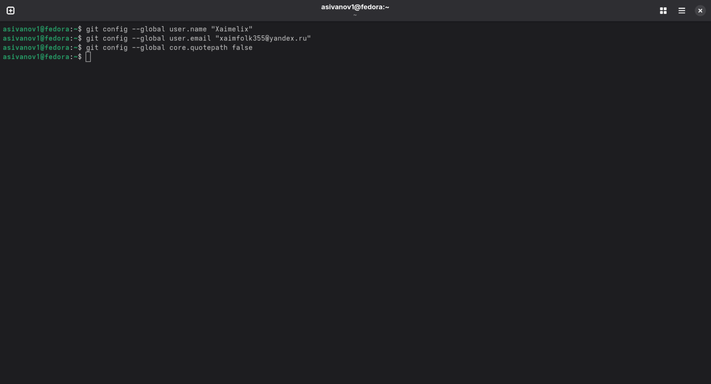{#fig:001 width=70%}

Зададим имя начальной ветки (будем называть её master). 

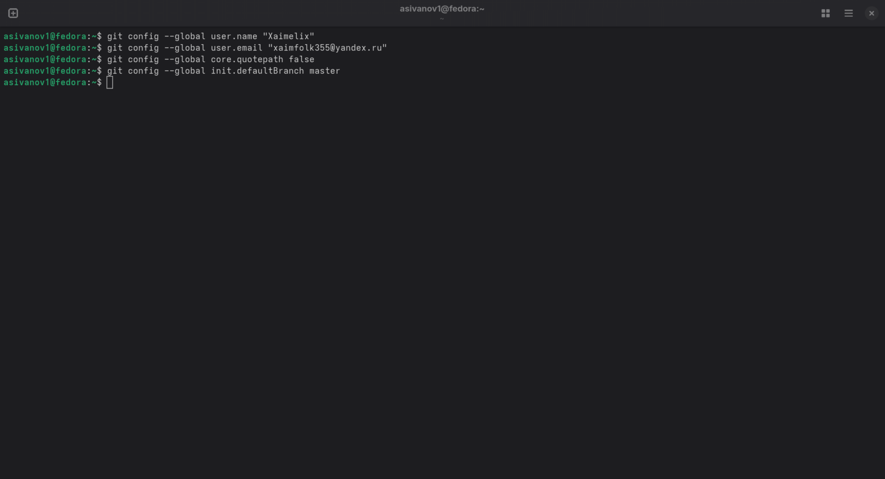{#fig:002 width=70%}

Зададим параметр autocrlf 

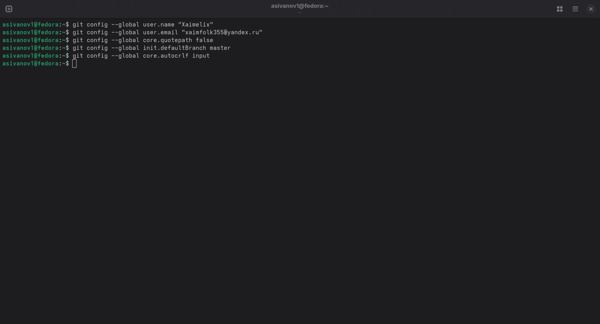{#fig:003 width=70%}

Зададим параметр safecrlf 

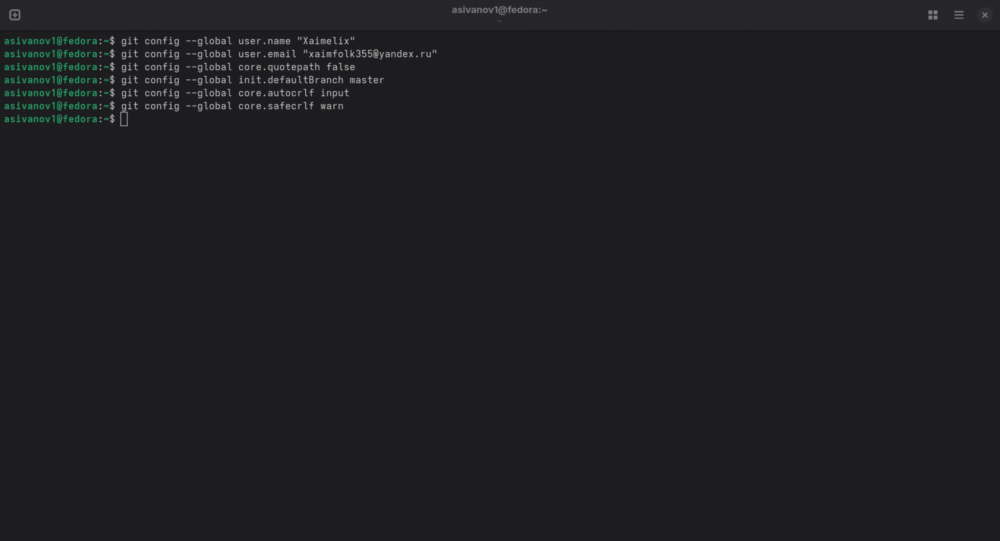{#fig:004 width=70%}

Для последующей идентификации пользователя на сервере репозиториев необходимо сгенерировать пару ключей (приватный и открытый) Рис. 2.5:

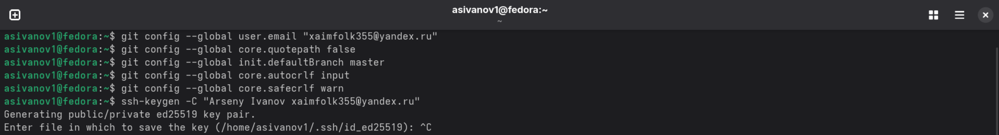{#fig:005 width=70%}

Далее необходимо загрузить сгенерированный открытый ключ. Для этого зайдем на сайт http://github.org/ под учётной записью и перейдем в меню Settings. После этого выбрать в боковом меню SSH and GPG keys и нажимаем кнопку New SSH key. Копируем из локальной консоли ключ в буфер обмена 

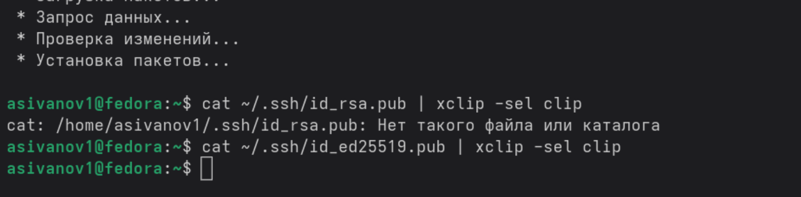{#fig:004 width=70%}

## Создание рабочего пространства и репозитория курса на основе шаблона

Рабочее
пространство
при
выполнении
лабораторных
работ
должно
придерживаться определённой структурной иерархии, для этого я создаю директорию
на своем рабочем компьютере. (рис. -@fig:005) 

{#fig:005 width=70%}

## Создание репозитория курса на основе шаблона

Создаю репозиторий на основе имеющего шаблона (рис. -@fig:006) через
функционал клонирования интерфейса GitHub. (рис. -@fig:007)

{#fig:006 width=70%}

{#fig:007 width=70%}

Сгенерированный репозиторий на основе шаблона клонирую на свой рабочий
компьютер, для этого беру ссылку для клонирования через интерфейс GitHub (рис. -@fig:008) и затем ввожу в терминале git clone. (рис. -@fig:009)

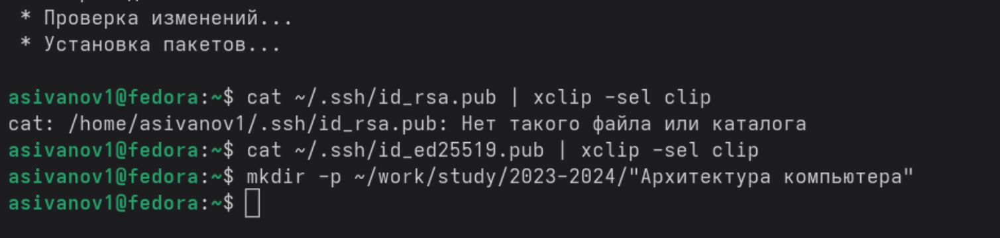{#fig:008 width=70%}

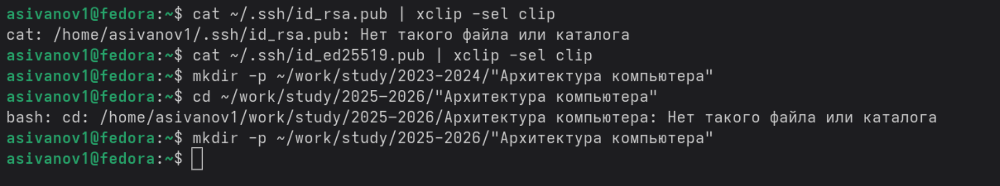{#fig:009 width=70%}

## Настройка каталога курса

В каталоге курса удаляю лишние файлы и формирую необходимые каталоги. (рис. -@fig:010)

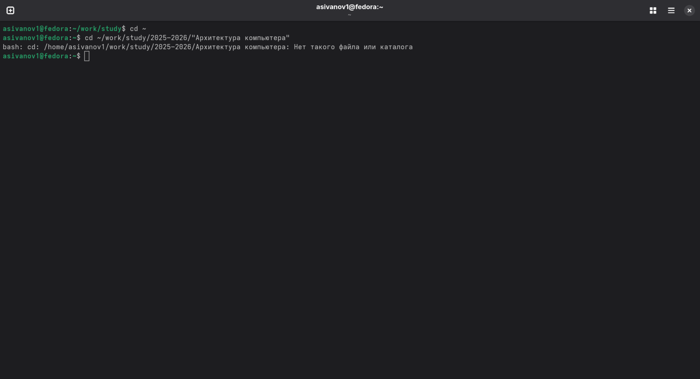{#fig:010 width=70%}

Делаю снимок сделанных изменений и push’у их на свой репозиторий в GitHub. (рис. -@fig:011)

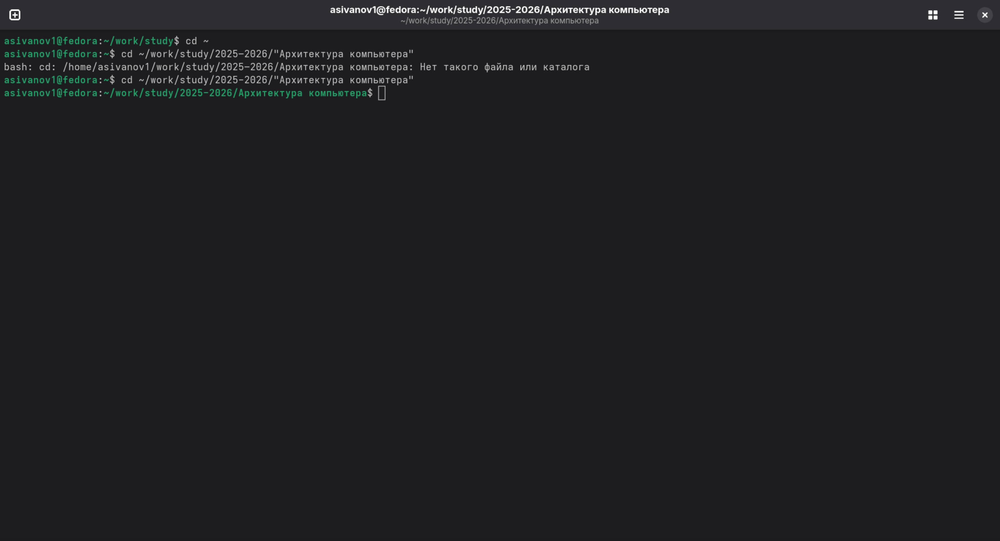{#fig:011 width=70%}

## Задания для самостоятельный работы

Через терминал отправляю предыдущий отчет по лабораторной работе на свой
удаленный репозиторий в GitHub (рис. -@fig:012), затем проверяю изменения на самом
GitHub. (рис. -@fig:013)

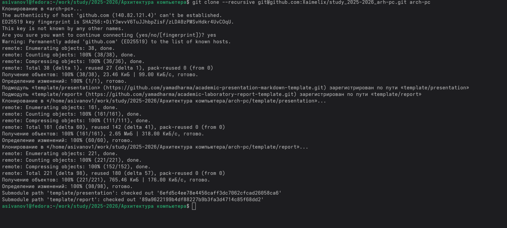{#fig:012 width=70%}

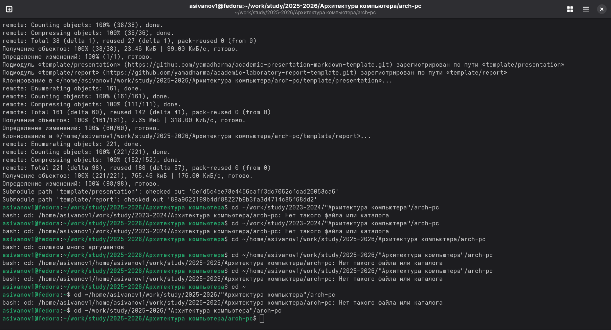{#fig:013 width=70%}

# Выводы

При выполнении данной лабораторной работы мы изучили идеологию и
применение средств контроля версий, а также приобрели практические навыки по
работе с реализацией VSC git.

