---
## Front matter
title: "Отчёт по лабораторной работе №4"
subtitle: "дисциплина: Архитектура компьютера"
author: "Иванов Арсений Сергеевич"

## Generic otions
lang: ru-RU
toc-title: "Содержание"

## Bibliography
bibliography: bib/cite.bib
csl: pandoc/csl/gost-r-7-0-5-2008-numeric.csl

## Pdf output format
toc: true # Table of contents
toc-depth: 2
lof: true # List of figures
lot: true # List of tables
fontsize: 12pt
linestretch: 1.5
papersize: a4
documentclass: scrreprt
## I18n polyglossia
polyglossia-lang:
  name: russian
  options:
    - spelling=modern
    - babelshorthands=true
polyglossia-otherlangs:
  name: english
## Fonts
mainfont: Liberation Serif
sansfont: Liberation Sans
monofont: Liberation Mono
mathfont: Latin Modern Math
mainfontoptions: Ligatures=Common,Ligatures=TeX,Scale=0.94
romanfontoptions: Ligatures=Common,Ligatures=TeX,Scale=0.94
sansfontoptions: Ligatures=Common,Ligatures=TeX,Scale=MatchLowercase,Scale=0.94
monofontoptions: Scale=MatchLowercase,Scale=0.94,FakeStretch=0.9
## Biblatex
biblatex: true
biblio-style: "gost-numeric"
biblatexoptions:
  - parentracker=true
  - backend=biber
  - hyperref=auto
  - citestyle=gost-numeric
## Pandoc-crossref LaTeX customization
figureTitle: "Рис."
tableTitle: "Таблица"
listingTitle: "Листинг"
lofTitle: "Список иллюстраций"
lotTitle: "Список таблиц"
lolTitle: "Листинги"
## Misc options
indent: true
header-includes:
  - \usepackage{indentfirst}
  - \usepackage{float} # keep figures where there are in the text
  - \floatplacement{figure}{H} # keep figures where there are in the text
---

# Цель работы

Целью данной работы является освоение процедуры компиляции и сборки программ, написанных на ассемблере NASM.

# Выполнение лабораторной работы

Открываем терминал.
Создадим каталог для работы с программами на языке NASM (Рис. 2.1)

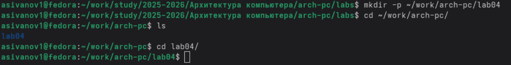{#fig:001 width=70%}

Создадим текстовый файл с именем hello.asm (Рис. 2.2)

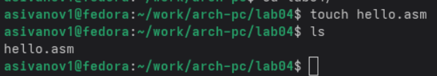{#fig:002 width=70%}

Откроем этот файл с помощью любого текстового редактора, и введем в него код, печатающий ‘Hello world!’ на экран. (Рис 2.3)

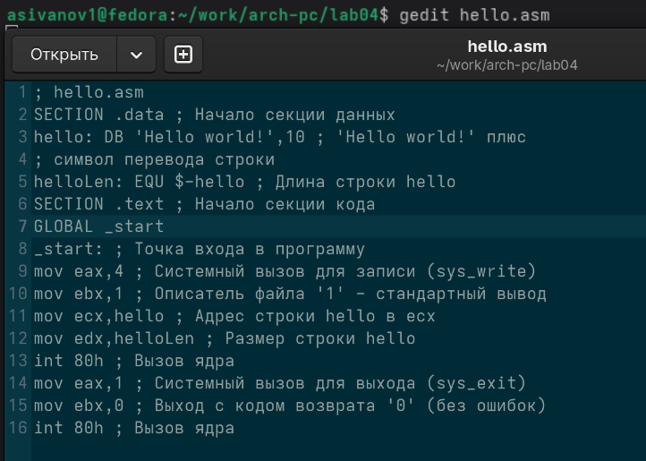{#fig:003 width=70%}

NASM превращает текст программы в объектный код. Например, для компиляции приведённого выше текста программы «Hello World» необходимо написать следующее (Рис. 2.4)

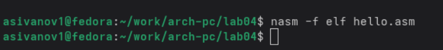{#fig:004 width=70%}

Полный вариант командной строки nasm выглядит следующим образом:
nasm [-@ косвенный_файл_настроек] [-o объектный_файл] [-f формат_объектного_файла] [-l листинг] [параметры...] [--] исходный_файл
Выполним следующую команду:
nasm -o obj.o -f elf -g -l list.lst hello.asm
Данная команда скомпилирует исходный файл hello.asm в obj.o (опция -o позволяет задать имя объектного файла, в данном случае obj.o), при этом формат выходного файла будет elf, и в него будут включены символы для отладки (опция -g), кроме того, будет создан файл листинга list.lst (опция -l).
С помощью команды ls проверим, что файлы были созданы. (Рис. 2.5)

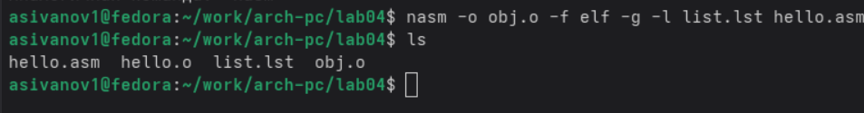{#fig:005 width=70%}

Чтобы получить исполняемую программу, объектный файл необходимо передать на обработку компоновщику:
ld -m elf_i386 hello.o -o hello
С помощью команды ls проверим, что исполняемый файл hello был создан (Рис. 2.7)

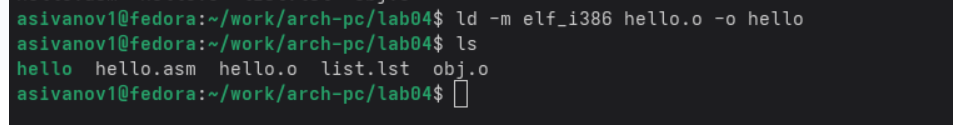{#fig:006 width=70%}

Ключ -o с последующим значением задаёт в данном случае имя создаваемого исполняемого файла (Рис. 2.8)
Выполним следующую команду:
ld -m elf_i386 obj.o -o main

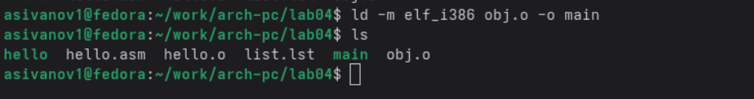{#fig:007 width=70%}

Как мы видим, в директории появился файл с именем: main
Запустить на выполнение созданный исполняемый файл, находящийся в текущем каталоге, можно, набрав в командной строке (Рис. 2.9)
./hello

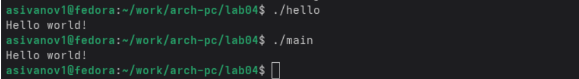{#fig:007 width=70%}

Вывод файла main и hello идентичны.

# Задания для самостоятельной работы

1. В каталоге ~/work/arch-pc/lab04 с помощью команды cp создадим копию файла hello.asm с именем lab4.asm (Рис 3.1)

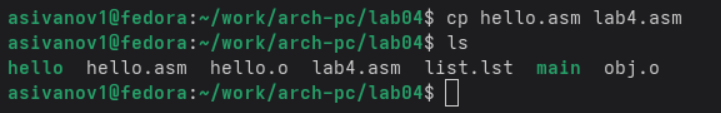{#fig:009 width=70%}

2. С помощью любого текстового редактора внесем изменения в текст программы в файле lab4.asm так, чтобы вместо Hello world! на экран выводилась строка с фамилией и именем (Рис. 3.2)

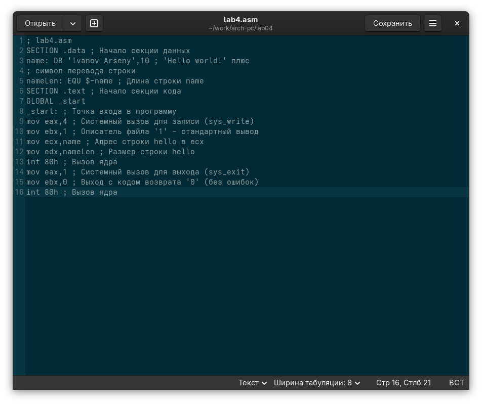{#fig:010 width=70%}

3. Оттранслируем полученный текст программы lab4.asm в объектный файл. Выполним компоновку объектного файла и запустим получившийся исполняемый файл.

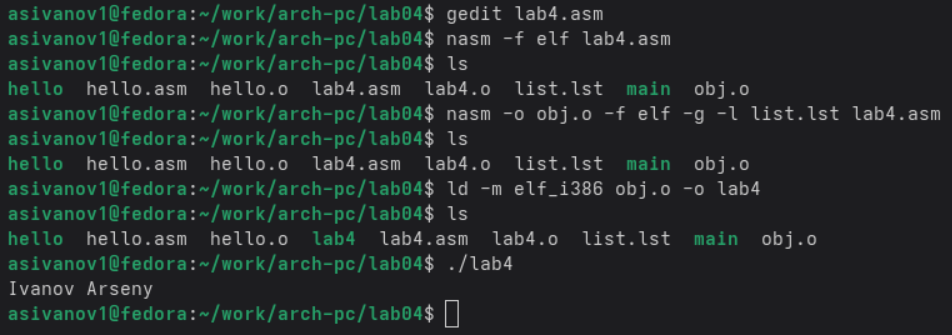{#fig:011 width=70%}

4. Скопируем файлы hello.asm и lab4.asm в локальный репозиторий в каталог ~/work/study/2023-2024/"Архитектура компьютера"/arch-pc/labs/lab04/. (Рис. 3.4)
Загрузим файлы на Github. (Рис. 3.5)

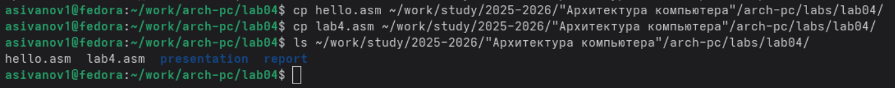{#fig:012 width=70%}

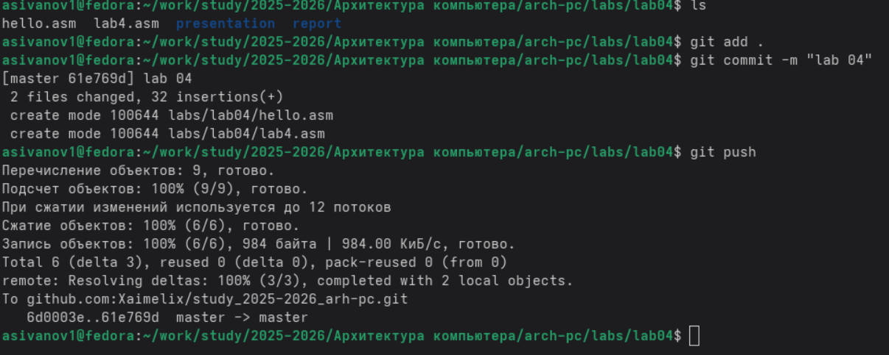{#fig:013 width=70%}

# Выводы

В результате выполнения данной лабораторной работы мы познакомились с процедурой компиляции и сборки программ, написанных на ассемблере NASM. 

