---
## Front matter
title: "Отчёт по лабораторной работе №5"
subtitle: "дисциплина: Архитектура компьютера"
author: "Иванов Арсений Сергеевич"

## Generic otions
lang: ru-RU
toc-title: "Содержание"

## Bibliography
bibliography: bib/cite.bib
csl: pandoc/csl/gost-r-7-0-5-2008-numeric.csl

## Pdf output format
toc: true # Table of contents
toc-depth: 2
lof: true # List of figures
lot: true # List of tables
fontsize: 12pt
linestretch: 1.5
papersize: a4
documentclass: scrreprt
## I18n polyglossia
polyglossia-lang:
  name: russian
  options:
    - spelling=modern
    - babelshorthands=true
polyglossia-otherlangs:
  name: english
biblatex: true
biblio-style: "gost-numeric"
biblatexoptions:
  - backend=biber
  - hyperref=auto
  - citestyle=gost-numeric
## Fonts
mainfont: Liberation Serif
sansfont: Liberation Sans
monofont: Liberation Mono
mathfont: Latin Modern Math
mainfontoptions: Ligatures=Common,Ligatures=TeX,Scale=0.94
romanfontoptions: Ligatures=Common,Ligatures=TeX,Scale=0.94
sansfontoptions: Ligatures=Common,Ligatures=TeX,Scale=MatchLowercase,Scale=0.94
monofontoptions: Scale=MatchLowercase,Scale=0.94,FakeStretch=0.9
## Pandoc-crossref LaTeX customization
figureTitle: "Рис."
tableTitle: "Таблица"
listingTitle: "Листинг"
lofTitle: "Список иллюстраций"
lotTitle: "Список таблиц"
lolTitle: "Листинги"
## Misc options
indent: true
header-includes:
  - \usepackage{indentfirst}
  - \usepackage{float} # keep figures where there are in the text
  - \floatplacement{figure}{H} # keep figures where there are in the text

---

# Цель работы

Приобретение практических навыков работы в Midnight Commander. Освоение инструкций языка ассемблера mov и int.

# Выполнение лабораторной работы

Открываем терминал.
Открываем Midnight Commander командой "mc" (рис. 2.1).

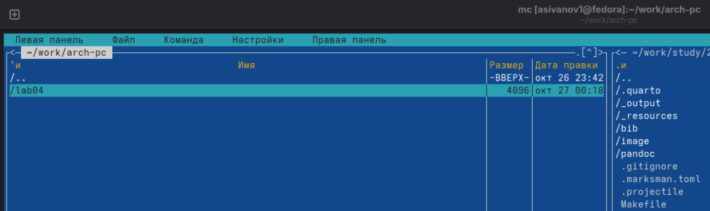{#fig:001 width=70%}

Пользуясь клавишами ↑ , ↓ и Enter перейдём в каталог ~/work/arch-pc созданный при выполнении лабораторной работы №4 (рис. 2.2).

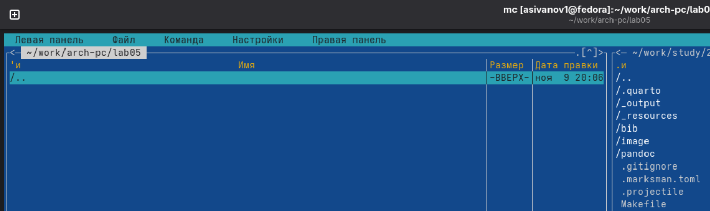{#fig:001 width=70%}

Пользуясь строкой ввода и командой touch создадим файл lab5-1.asm (рис. 2.3).

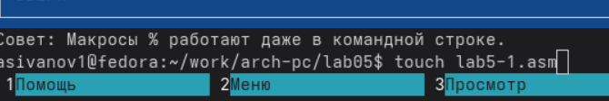{#fig:002 width=70%}

С помощью функциональной клавиши F4 откроем файл lab5-1.asm для редактирования во встроенном редакторе. Как правило в качестве встроенного редактора Midnight Commander используется редакторы nano или mcedit.

Введём текст программы, сохраним изменения и закройтем файл. (рис 2.4).

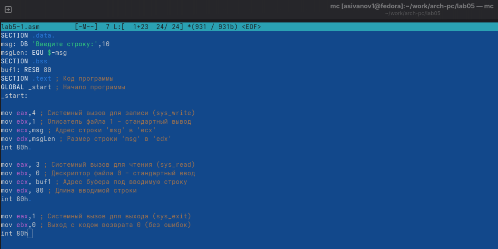{#fig:002 width=70%}

С помощью функциональной клавиши F3 откроем файл lab5-1.asm для просмотра. Убедимся, что файл содержит текст программы. (рис 2.5)

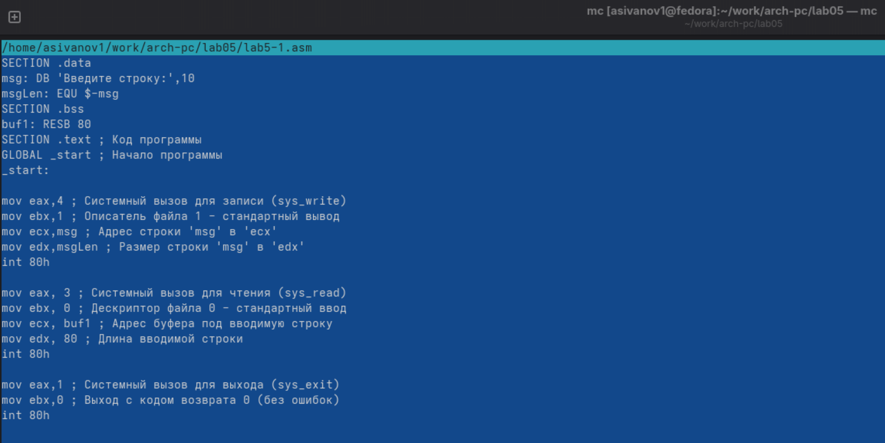{#fig:002 width=70%}

Оттранслируем текст программы lab5-1.asm в объектный файл. Выполниим компоновку объектного файла и запустим получившийся исполняемый файл. Программа
выводит строку 'Введите строку:' и ожидает ввода с клавиатуры. (рис 2.6)

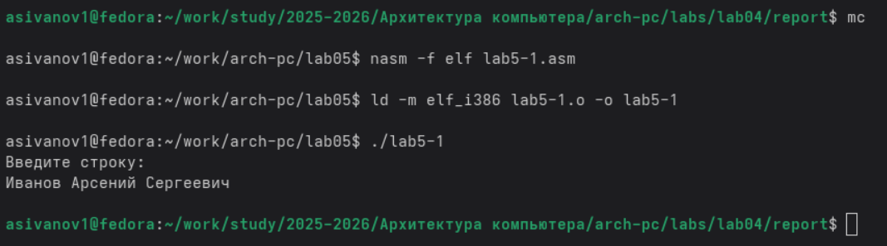{#fig:002 width=70%}

В одной из панелей mc откроем каталог с файлом lab5-1.asm. В другой панели каталог со скаченным файлом in_out.asm.
Скопируем файл in_out.asm в каталог с файлом lab5-1.asm с помощью функциональной клавиши F5 (рис 2.7)

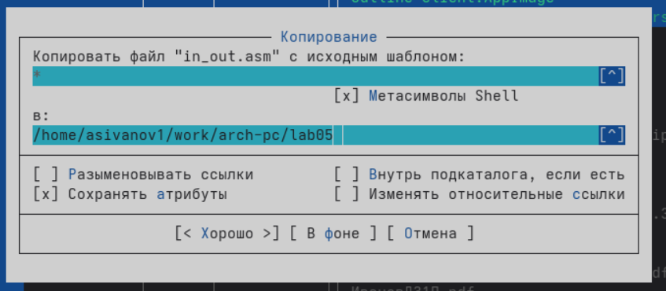{#fig:002 width=70%}

С помощью функциональной клавиши F6 создадим копию файла lab5-1.asm с именем lab5-2.asm. Выделим файл lab5-1.asm, нажмём клавишу F6 , введём имя файла lab5-2.asm и нажмём клавишу Enter (рис. 2.8)

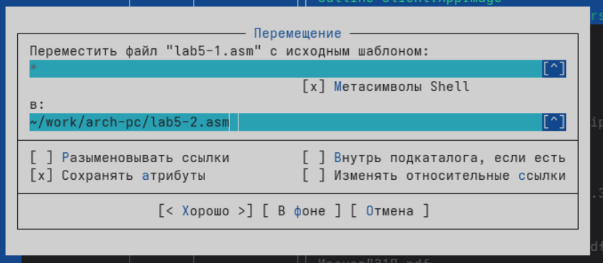{#fig:002 width=70%}

Исправим текст программы в файле lab5-2.asm с использованием подпрограмм из внешнего файла in_out.asm (используем подпрограммы sprintLF, sread и quit) в соответствии с листингом 5.2 (рис. 2.9). Создадим исполняемый файл и проверим его работу. (рис. 2.10)

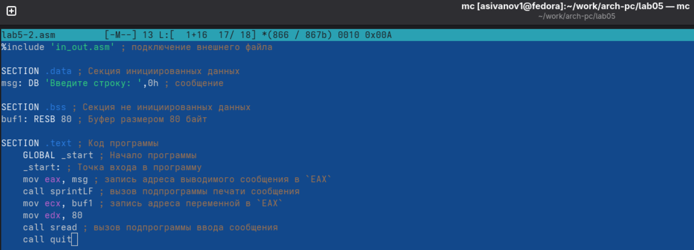{#fig:002 width=70%}

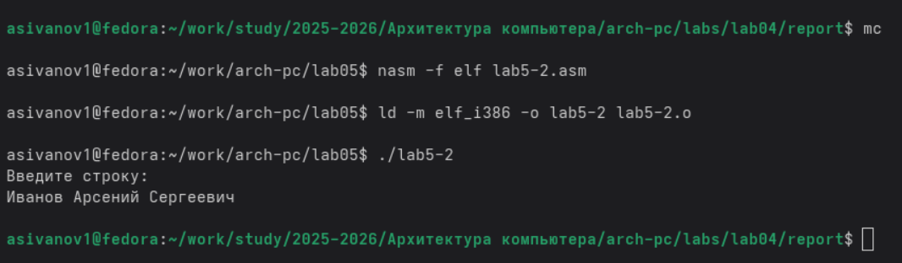{#fig:002 width=70%}

В файле lab5-2.asm заменим подпрограмму sprintLF на sprint. Создадим исполняемый файл и проверим его работу. 
Теперь запрос ввода пользователя происходит в той же строке, что и вывод.

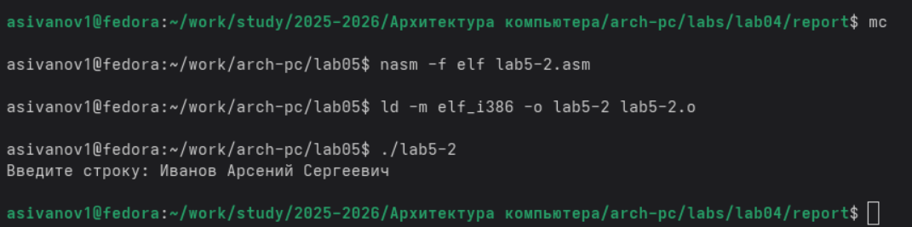{#fig:002 width=70%}

# Задания для самостоятельной работы

1. Создайте копию файла lab5-1.asm. Внесите изменения в программу (без использова-
ния внешнего файла in_out.asm), так чтобы она работала по следующему алгоритму:
• вывести приглашение типа “Введите строку:”;
• ввести строку с клавиатуры;
• вывести введённую строку на экран.

Решение представлено в рис 3.1 и рис 3.2

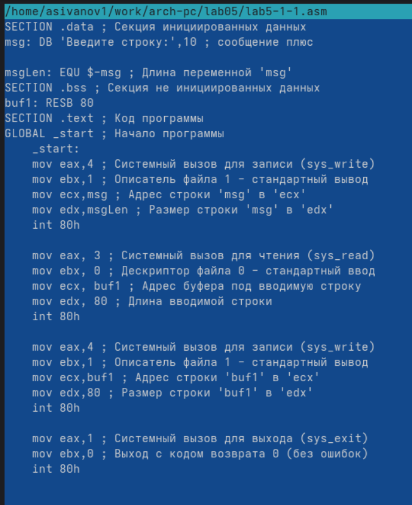{#fig:002 width=70%}

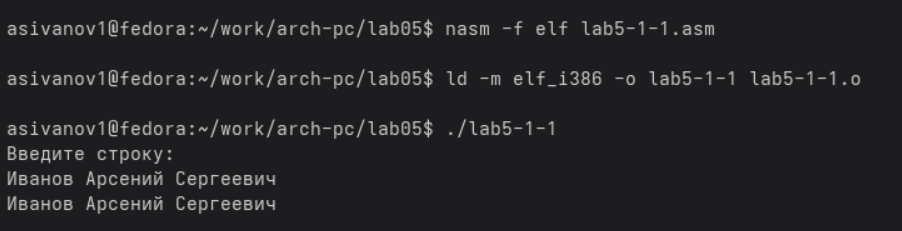{#fig:002 width=70%}

2. Создайте копию файла lab5-2.asm. Исправьте текст программы с использование под-
программ из внешнего файла in_out.asm, так чтобы она работала по следующему
алгоритму:
• вывести приглашение типа “Введите строку:”;
• ввести строку с клавиатуры;
• вывести введённую строку на экран

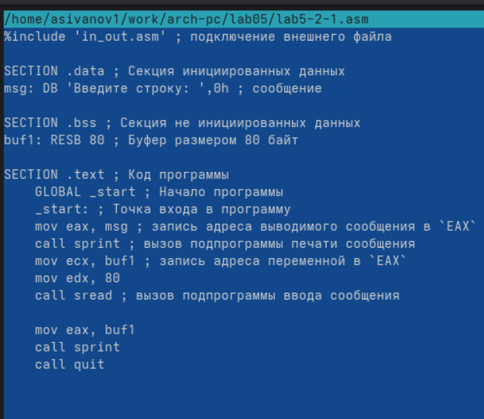{#fig:002 width=70%}

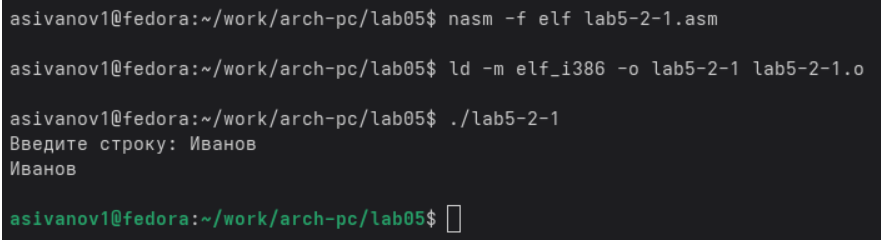{#fig:002 width=70%}

# Выводы

При выполнении данной лабораторной работы мы приобрёли практические навыки работы в Midnight Commander, 
а также освоили инструкции языка ассемблера mov и int.

В результате выполнения данной лабораторной работы мы познакомились с процедурой компиляции и сборки программ, написанных на ассемблере NASM. 

