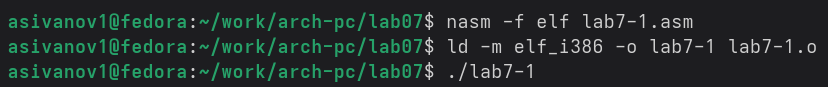
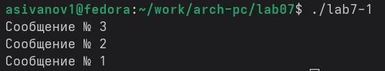
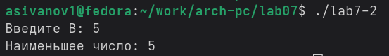
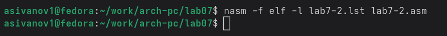
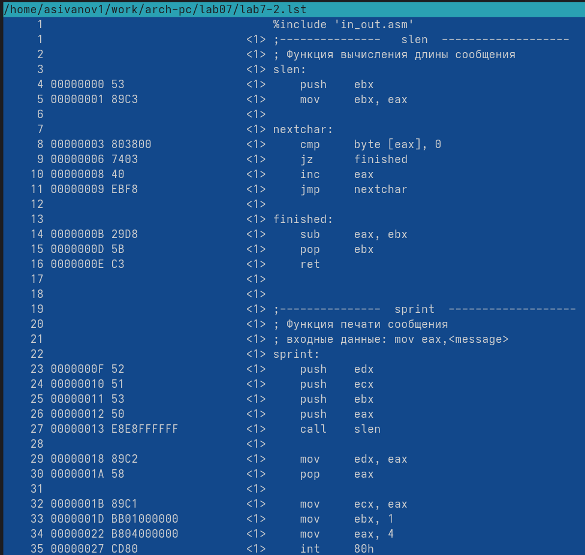
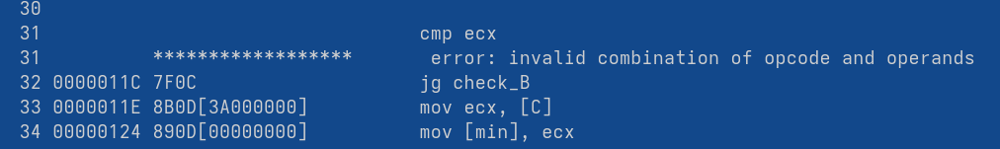
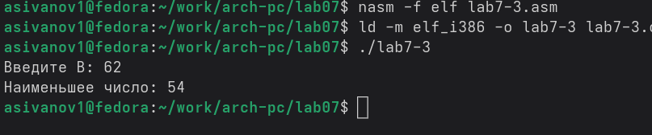
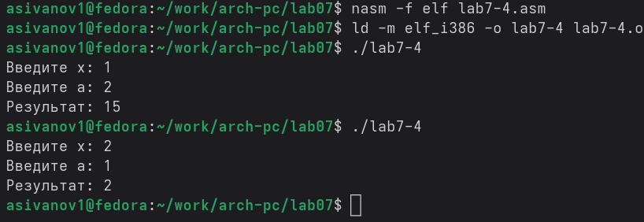

---
## Front matter
title: "Отчёт по лабораторной работе №7"
subtitle: "дисциплина: Архитектура компьютера"
author: "Иванов Арсений Сергеевич"

## Generic otions
lang: ru-RU
toc-title: "Содержание"

## Bibliography
bibliography: bib/cite.bib
csl: pandoc/csl/gost-r-7-0-5-2008-numeric.csl

## Pdf output format
toc: true # Table of contents
toc-depth: 2
lof: true # List of figures
lot: true # List of tables
fontsize: 12pt
linestretch: 1.5
papersize: a4
documentclass: scrreprt
## I18n polyglossia
polyglossia-lang:
  name: russian
  options:
    - spelling=modern
    - babelshorthands=true
polyglossia-otherlangs:
  name: english
biblatex: true
biblio-style: "gost-numeric"
biblatexoptions:
  - backend=biber
  - hyperref=auto
  - citestyle=gost-numeric
## Fonts
mainfont: Liberation Serif
sansfont: Liberation Sans
monofont: Liberation Mono
mathfont: Latin Modern Math
mainfontoptions: Ligatures=Common,Ligatures=TeX,Scale=0.94
romanfontoptions: Ligatures=Common,Ligatures=TeX,Scale=0.94
sansfontoptions: Ligatures=Common,Ligatures=TeX,Scale=MatchLowercase,Scale=0.94
monofontoptions: Scale=MatchLowercase,Scale=0.94,FakeStretch=0.9
## Pandoc-crossref LaTeX customization
figureTitle: "Рис."
tableTitle: "Таблица"
listingTitle: "Листинг"
lofTitle: "Список иллюстраций"
lotTitle: "Список таблиц"
lolTitle: "Листинги"
## Misc options
indent: true
header-includes:
  - \usepackage{indentfirst}
  - \usepackage{float} # keep figures where there are in the text
  - \floatplacement{figure}{H} # keep figures where there are in the text

---

# Цель работы

Целью данной лабораторной работы является изучение команд условного и
безусловного переходов в языке ассемблера NASM. Необходимо приобрести практические
навыки написания программ с использованием механизмов ветвления и циклов. Также важной частью работы
является знакомство с назначением и структурой файла листинга (.lst), который необходим
для отладки и анализа низкоуровневого кода.

# Выполнение лабораторной работы

Для начала работы я создал каталог lab07 в своей рабочей директории и перешел в
него. Затем я создал файл lab7-1.asm с помощью текстового редактора.
Задача состояла в том, чтобы написать программу, использующую инструкцию jmp
для изменения порядка вывода сообщений на экран.

Компиляция и запуск (Рис. 2.1):

{#fig:001 width=70%}

В данной программе я использовал три метки: _label1, _label2, _label3 и метку завершения
_end. Логика работы программы следующая:
1. Сразу после старта (_start) выполняется безусловный переход jmp _label3.
2. Программа переходит к метке _label3, где выводится "Сообщение № 3", после чего
выполняется jmp _label2.
3. Управление передается на метку _label2, выводится "Сообщение № 2", затем идет
переход jmp _label1.
4. На метке _label1 выводится "Сообщение № 1" и выполняется финальный переход jmp
_end.
5. На метке _end программа корректно завершает работу.

Результат работы программы (Рис. 2.2):

{#fig:001 width=70%}

Инструкция jmp позволила изменить порядок вывода сообщений на обратный.

Программа с условными переходами

Требуется написать программу, которая определяет наибольшее
из трех чисел: переменные A и C заданы в коде, а B вводится с клавиатуры.
Я создал файл lab7-2.asm. Для реализации ввода и сравнения чисел я использовал
функции из подключаемого файла in_out.asm. Ввод с клавиатуры дает символьную строку, которую необходимо преобразовать в целое число
функцией atoi перед выполнением арифметического сравнения. 

Алгоритм работы программы:
1. Программа выводит приглашение "Введите B".
2. Считывает строку с консоли.
3. Преобразует введенную строку в число (функция atoi).
4. Сравнивает заданное число A с числом C. Если A > C, то программа
запоминает A как текущий максимум, иначе — C.
5. Затем текущий максимум сравнивается с введенным числом B. Если B больше, то оно
становится новым максимумом.
6. Результат выводится на экран.

{#fig:001 width=70%}

Изучение файла листинга

Файл листинга — это текстовый файл, который генерируется ассемблером и
показывает взаимосвязь между исходным кодом и машинными инструкциями. Я создал файл
листинга командой:

{#fig:001 width=70%}

Затем я открыл полученный файл lab7-2.lst в текстовом редакторе Midnight Commander. (Рис. 2.5)

{#fig:001 width=70%}

Первое значение в файле листинга - номер строки, который может не совпадать с номером строки изначального файла кода NASM. Далее - адрес, смещение машинного кода относительно начала текущего сегмента, затем идет сам машинный код, а в конце идет исходный текст прогарммы.

Удаляю один операнд инструкции. Транслирую файл.

Ассемблер выдал ошибку "invalid combination of opcode and operands" терминал. В файле листинга можно заметить ошибку (Рис. 2.6)

{#fig:001 width=70%}

# Задания для самостоятельной работы

Вариант задания: 5

1. Я создал файл lab7-3.asm. (Рис. 3.1)

{#fig:001 width=70%}

2. Пишу программу, которая будет вычислять значение заданной функции для введенных с клавиатурых переменных a и x, создаю файл lab7-4.asm (Рис. 3.2)

{#fig:001 width=70%}

# Выводы

При выполнении лабораторной работы я изучил команды условных и безусловных переходов, а также приобрел навыки написания программ с использованием перходов, познакомился с назначением и структурой файлов листинга.

