---
## Front matter
title: "Отчёт по лабораторной работе №8"
subtitle: "дисциплина: Архитектура компьютера"
author: "Иванов Арсений Сергеевич"

## Generic otions
lang: ru-RU
toc-title: "Содержание"

## Bibliography
bibliography: bib/cite.bib
csl: pandoc/csl/gost-r-7-0-5-2008-numeric.csl

## Pdf output format
toc: true # Table of contents
toc-depth: 2
lof: true # List of figures
lot: true # List of tables
fontsize: 12pt
linestretch: 1.5
papersize: a4
documentclass: scrreprt
## I18n polyglossia
polyglossia-lang:
  name: russian
  options:
    - spelling=modern
    - babelshorthands=true
polyglossia-otherlangs:
  name: english
biblatex: true
biblio-style: "gost-numeric"
biblatexoptions:
  - backend=biber
  - hyperref=auto
  - citestyle=gost-numeric
## Fonts
mainfont: Liberation Serif
sansfont: Liberation Sans
monofont: Liberation Mono
mathfont: Latin Modern Math
mainfontoptions: Ligatures=Common,Ligatures=TeX,Scale=0.94
romanfontoptions: Ligatures=Common,Ligatures=TeX,Scale=0.94
sansfontoptions: Ligatures=Common,Ligatures=TeX,Scale=MatchLowercase,Scale=0.94
monofontoptions: Scale=MatchLowercase,Scale=0.94,FakeStretch=0.9
## Pandoc-crossref LaTeX customization
figureTitle: "Рис."
tableTitle: "Таблица"
listingTitle: "Листинг"
lofTitle: "Список иллюстраций"
lotTitle: "Список таблиц"
lolTitle: "Листинги"
## Misc options
indent: true
header-includes:
  - \usepackage{indentfirst}
  - \usepackage{float} # keep figures where there are in the text
  - \floatplacement{figure}{H} # keep figures where there are in the text

---

# Цель работы

Приобретение навыков написания программ с использованием циклов и обработкой аргументов командной строки.

# Выполнение лабораторной работы

Создаю каталог для программам лабораторной работы № 8, перейду в него и создаю
файл lab8-1.asm (рис. 2.1):

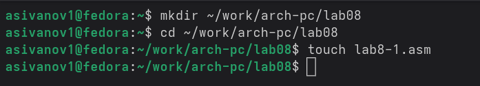{#fig:001 width=70%}

Копирую в созданный файл программу из листинга. Запускаю программу, она показывает работу циклов в NASM. (рис. 2.2)

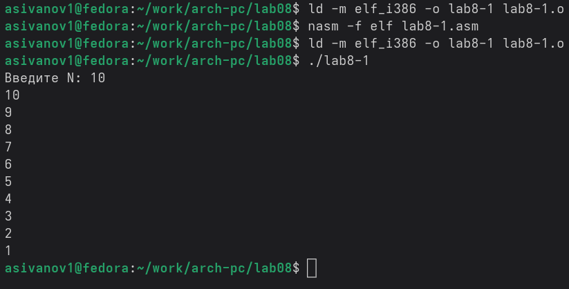{#fig:001 width=70%}

Изменяю программу изначальную, в теле цикла значение регистра ecx. (рис. 2.3)

{#fig:001 width=70%}

Из-за того, что теперь регистр ecx на каждой итерации уменьшается на 2 значения, количество итераций уменьшается вдвое (рис. 2.4).

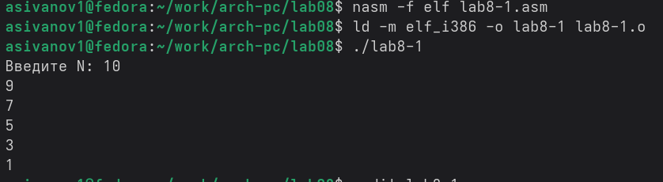{#fig:001 width=70%}

Добавляю команды push и pop в программу (рис. 2.5).

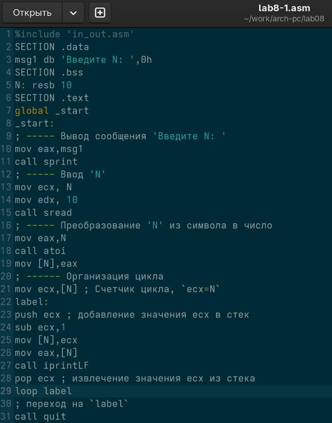{#fig:001 width=70%}

Теперь количество итераций совпадает введенному N, теперь последнее значкение - 0 (рис. 2.6).

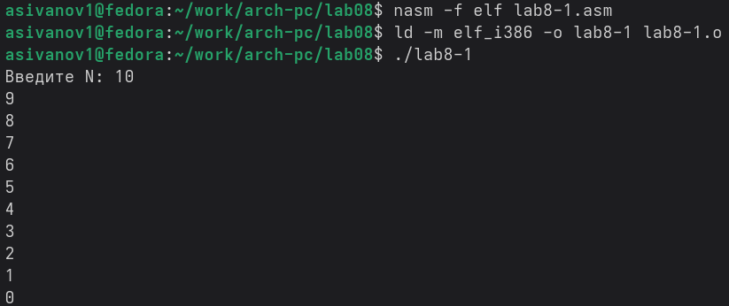{#fig:001 width=70%}

Создаю новый файл для программы и копирую в него код из следующего листинга (рис. 2.7).

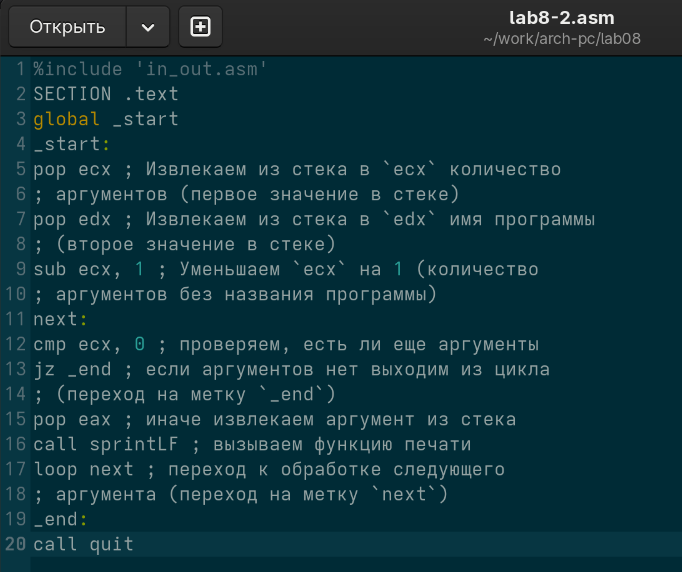{#fig:001 width=70%}

Компилирую программу и запускаю с аргументами. Программой было обратано то же количество аргументов, что и было введено (рис. 2.8).

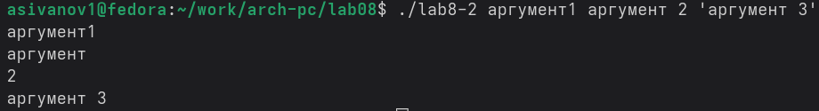{#fig:001 width=70%}

Создаю новый файл для программы и копирую в него код из третьего листинга (рис. 2.9).

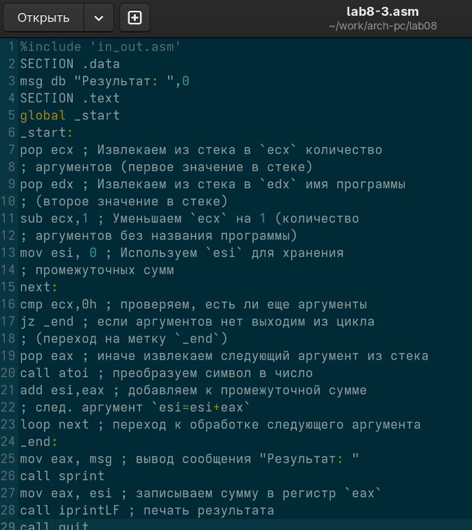{#fig:001 width=70%}

Компилирую программу и запускаю, указав в качестве аргументов некоторые числа, программа их складывает (рис. 2.10).

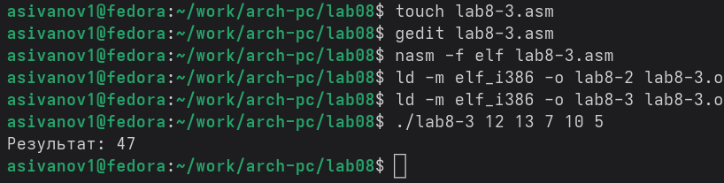{#fig:001 width=70%}

Изменяю поведение программы так, чтобы указанные аргументы она умножала (рис. 2.11).

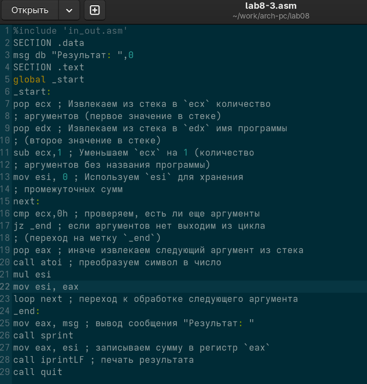{#fig:001 width=70%}

Программа теперь умножает числа со входа (рис. 2.12).

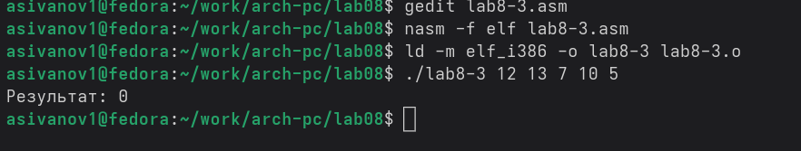{#fig:001 width=70%}

# Задания для самостоятельной работы

Вариант задания: 5

Пишу программму, которая будет находить сумма значений для функции f(x) = 4x+3 (рис. 3.1).

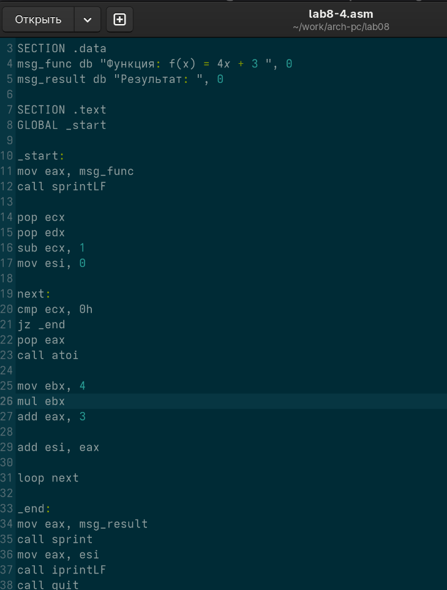{#fig:001 width=70%}

Проверяю работу программы, указав в качестве аргумента несколько чисел из примера (рис. 3.2).

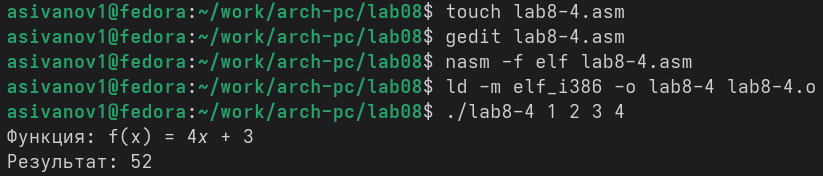{#fig:001 width=70%}

# Выводы

В результате выполнения данной лабораторной работы я приобрел навыки написания программ с использованием циклов а также научился обрабатывать аргументы командной строки.

