---
## Front matter
title: "Отчёт по лабораторной работе №9"
subtitle: "дисциплина: Архитектура компьютера"
author: "Иванов Арсений Сергеевич"

## Generic otions
lang: ru-RU
toc-title: "Содержание"

## Bibliography
bibliography: bib/cite.bib
csl: pandoc/csl/gost-r-7-0-5-2008-numeric.csl

## Pdf output format
toc: true # Table of contents
toc-depth: 2
lof: true # List of figures
lot: true # List of tables
fontsize: 12pt
linestretch: 1.5
papersize: a4
documentclass: scrreprt
## I18n polyglossia
polyglossia-lang:
  name: russian
  options:
    - spelling=modern
    - babelshorthands=true
polyglossia-otherlangs:
  name: english
biblatex: true
biblio-style: "gost-numeric"
biblatexoptions:
  - backend=biber
  - hyperref=auto
  - citestyle=gost-numeric
## Fonts
mainfont: Liberation Serif
sansfont: Liberation Sans
monofont: Liberation Mono
mathfont: Latin Modern Math
mainfontoptions: Ligatures=Common,Ligatures=TeX,Scale=0.94
romanfontoptions: Ligatures=Common,Ligatures=TeX,Scale=0.94
sansfontoptions: Ligatures=Common,Ligatures=TeX,Scale=MatchLowercase,Scale=0.94
monofontoptions: Scale=MatchLowercase,Scale=0.94,FakeStretch=0.9
## Pandoc-crossref LaTeX customization
figureTitle: "Рис."
tableTitle: "Таблица"
listingTitle: "Листинг"
lofTitle: "Список иллюстраций"
lotTitle: "Список таблиц"
lolTitle: "Листинги"
## Misc options
indent: true
header-includes:
  - \usepackage{indentfirst}
  - \usepackage{float} # keep figures where there are in the text
  - \floatplacement{figure}{H} # keep figures where there are in the text

---

# Цель работы

Приобретение навыков написания программ с использованием подпрограмм. Знакомство с методами отладки при помощи GDB и его основными возможностями.

# Выполнение лабораторной работы

Создаю каталог для выполнения лабораторной работы №9 (рис. -@fig:001).

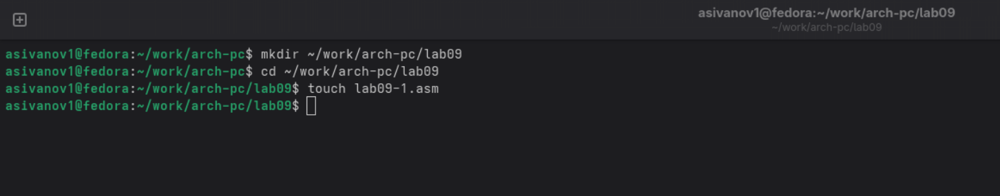{#fig:001 width=70%}

Копирую в файл код из листинга, компилирую и запускаю его, данная программа выполняет вычисление функции (рис. -@fig:002).

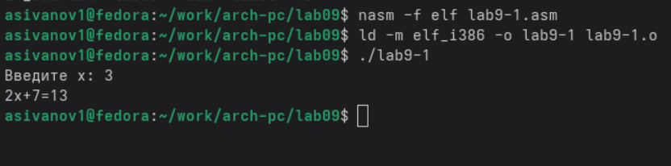{#fig:002 width=70%}

Изменяю текст программы, добавив в нее подпрограмму, теперь она вычисляет значение функции для выражения f(g(x)) (рис. -@fig:003).

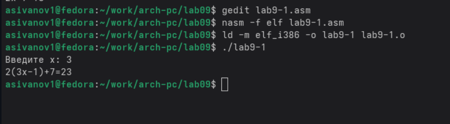{#fig:003 width=70%}

### Отладка программ с помощью GDB

В созданный файл копирую программу второго листинга, транслирую с созданием файла листинга и отладки, компоную и запускаю в отладчике (рис. -@fig:004).

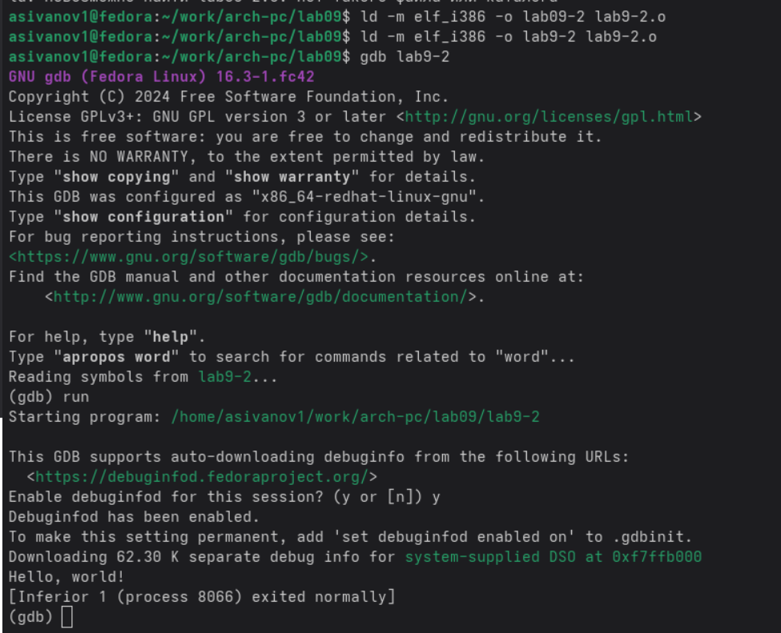{#fig:004 width=70%}

Запустив программу командой run, я убедился в том, что она работает исправно (рис. -@fig:005).

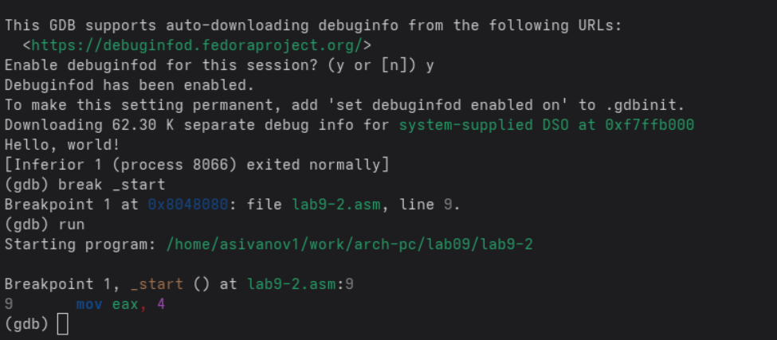{#fig:005 width=70%}

Далее смотрю дисассимилированный код программы, перевожу на команд с синтаксисом Intel (рис. -@fig:006).
Различия между синтаксисом ATT и Intel заключаются в порядке операндов (ATT - Операнд источника указан первым. Intel - Операнд назначения указан первым), их размере (ATT - pазмер операндов указывается явно с помощью суффиксов, непосредственные операнды предваряются символом $; Intel - Размер операндов неявно определяется контекстом, как ax, eax, непосредственные операнды пишутся напрямую), именах регистров(ATT - имена регистров предваряются символом %, Intel - имена регистров пишутся без префиксов).

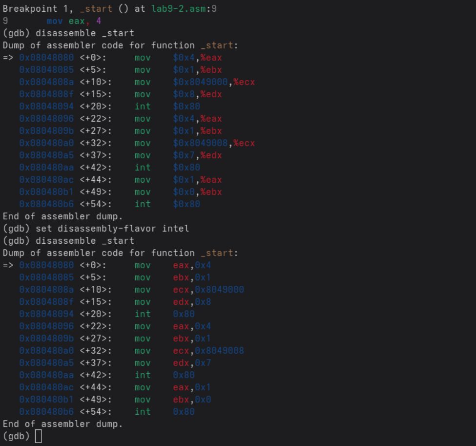{#fig:006 width=70%}

Включаю режим псевдографики для более удобного анализа программы (рис. -@fig:007).

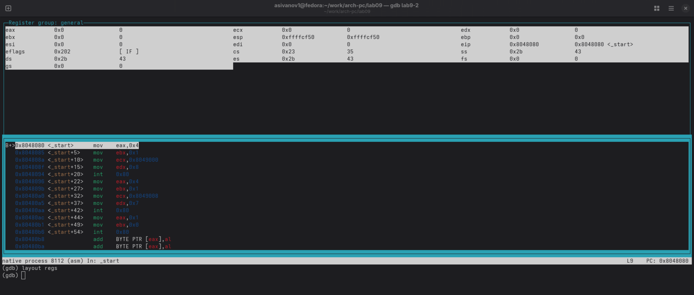{#fig:007 width=70%}

### Добавление точек останова

Проверяю в режиме псевдографики, что брейкпоинт сохранился (рис. -@fig:008).

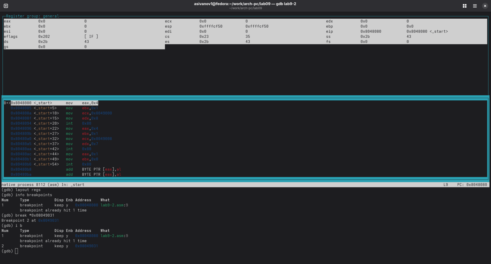{#fig:008 width=70%}

Устаналиваю еще одну точку останова по адресу инструкции (рис. -@fig:09).

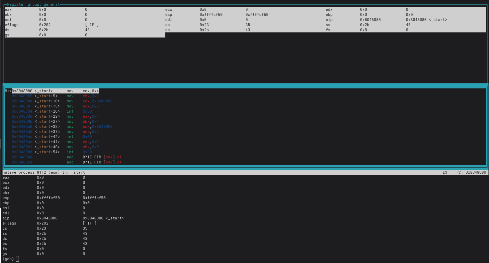{#fig:09 width=70%}

### Работа с данными программы в GDB

Просматриваю содержимое регистров командой info registers (рис. -@fig:010).

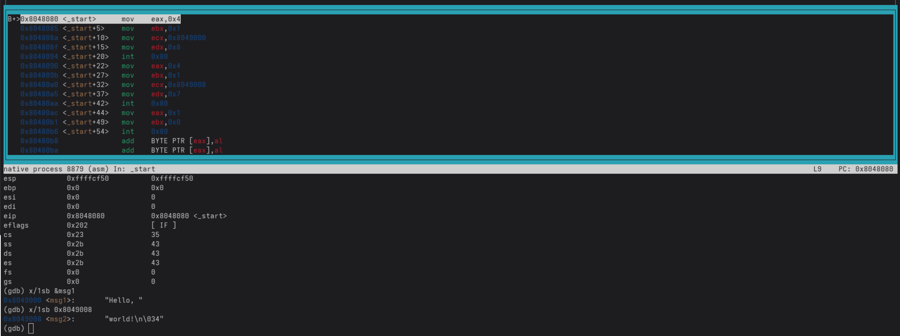{#fig:010 width=70%}

Смотрю содержимое переменных по имени и по адресу (рис. -@fig:011).

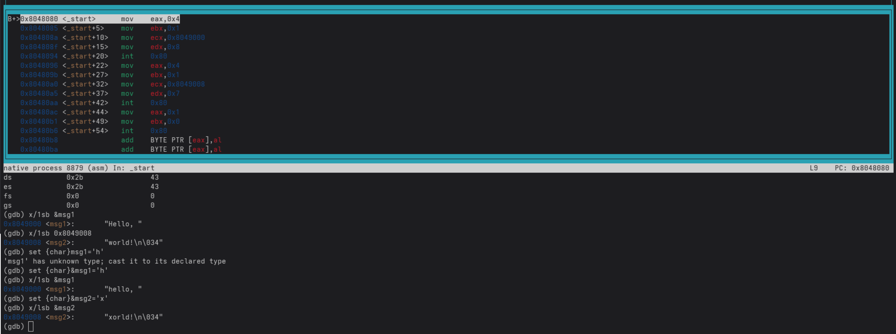{#fig:011 width=70%}

### Обработка аргументов командной строки в GDB

Копирую программу из предыдущей лабораторной работы в текущий каталог и и создаю исполняемый файл с файлом листинга и отладки (рис. -@fig:012).

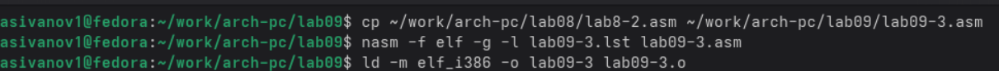{#fig:012 width=70%}

Запускаю программу с режиме отладки с указанием аргументов, указываю брейкпопнт и запускаю отладку. Проверяю работу стека, 
изменяя аргумент команды просмотра регистра esp на +4, число обусловлено разрядностью системы, а указатель void занимает как раз 4 байта,
ошибка при аргументе +24 означает, что аргументы на вход программы закончились. (рис. -@fig:014).

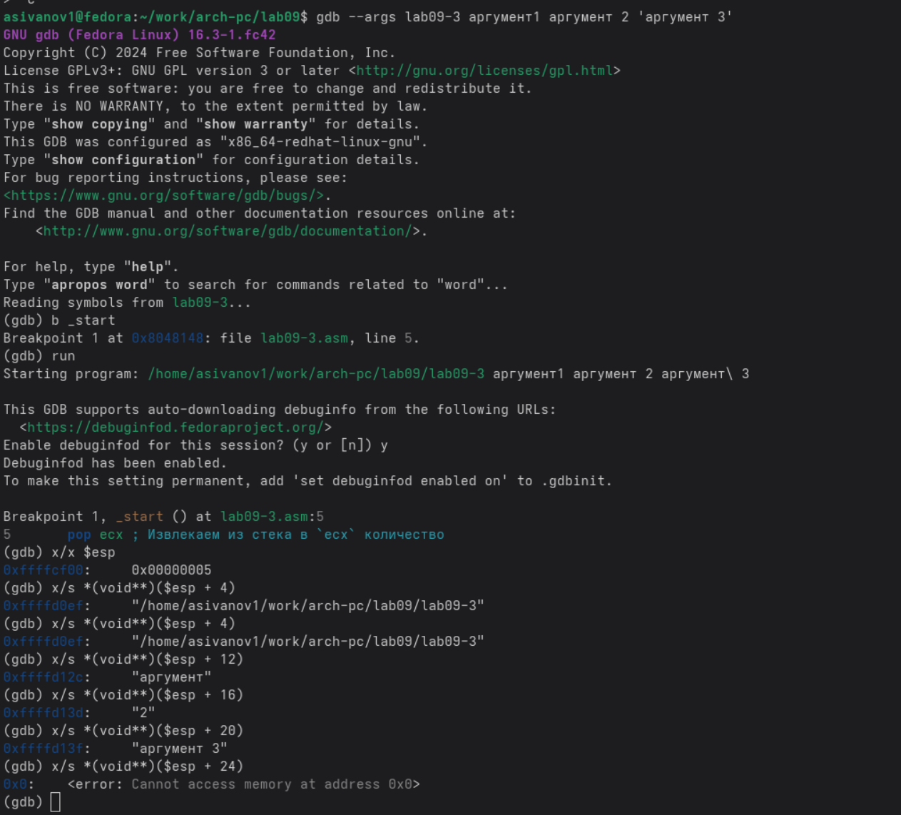{#fig:014 width=70%}

# Задания для самостоятельной работы


1. Меняю программу самостоятельной части предыдущей лабораторной работы с использованием подпрограммы (рис. -@fig:013).

Код программы:

```NASM
%include 'in_out.asm'

SECTION .data
msg_func db "Функция: f(x) = 10x - 4", 0
msg_result db "Результат: ", 0

SECTION .text
GLOBAL _start

_start:
mov eax, msg_func
call sprintLF

pop ecx
pop edx
sub ecx, 1
mov esi, 0

next:
cmp ecx, 0h
jz _end
pop eax
call atoi

call _calculate_fx

add esi, eax
loop next

_end: 
mov eax, msg_result
call sprint
mov eax, esi
call iprintLF
call quit

_calculate_fx:
mov ebx, 10
mul ebx
sub eax, 4
```

2. Запускаю программу в режике отладичка и пошагово через si просматриваю изменение значений регистров через i r.
При выполнении инструкции mul ecx можно заметить, что результат умножения записывается в регистр eax, но также меняет и edx. 
Значение регистра ebx не обновляется напрямую, поэтому результат программа неверно подсчитывает функцию (рис. -@fig:015).

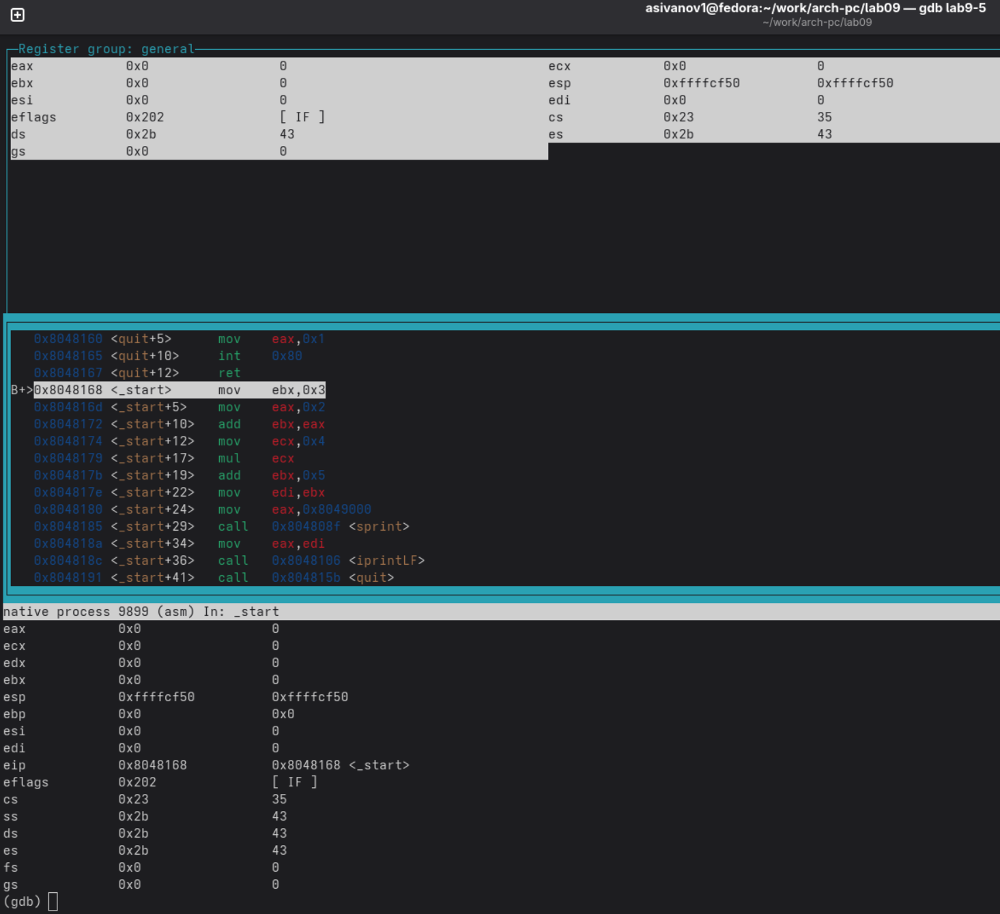{#fig:015 width=70%}

Исправляю найденную ошибку, теперь программа верно считает значение функции.

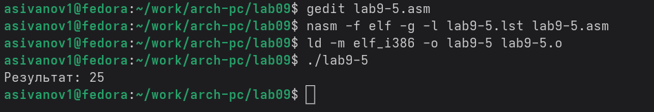{#fig:016 width=70%}

# Выводы

В результате выполнения данной лабораторной работы я приобрел навыки написания программ с использованием подпрограмм, а так же познакомился с методами отладки при поомщи GDB и его основными возможностями.

