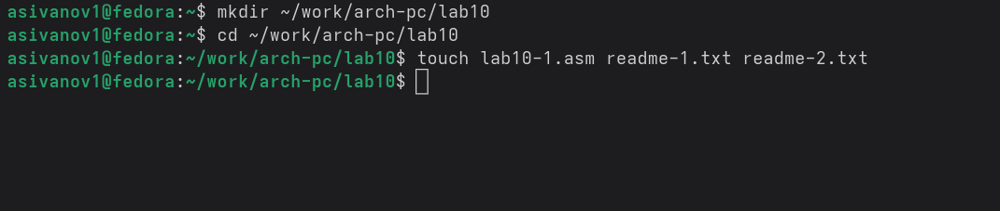
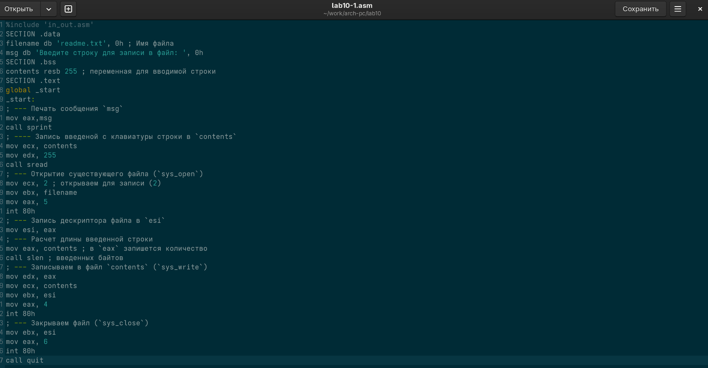
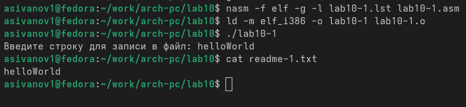
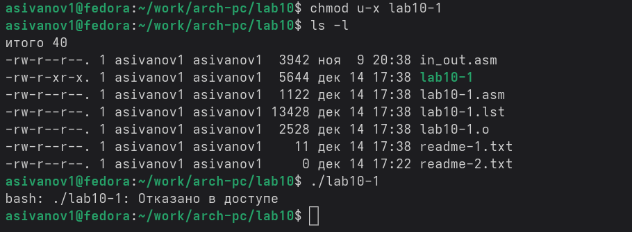
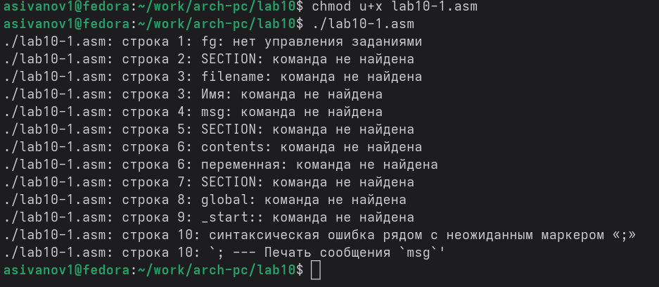
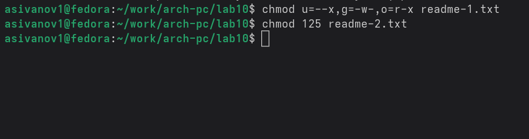
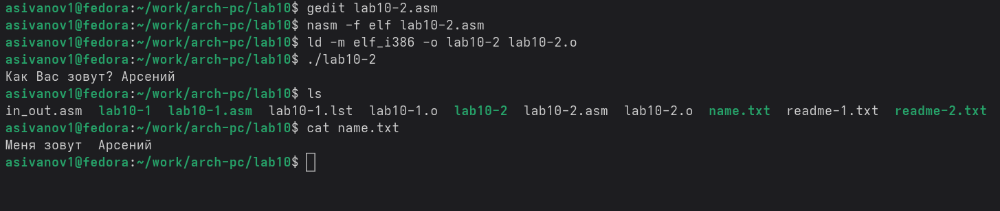

---
## Front matter
title: "Отчёт по лабораторной работе №10"
subtitle: "дисциплина: Архитектура компьютера"
author: "Иванов Арсений Сергеевич"

## Generic otions
lang: ru-RU
toc-title: "Содержание"

## Bibliography
bibliography: bib/cite.bib
csl: pandoc/csl/gost-r-7-0-5-2008-numeric.csl

## Pdf output format
toc: true # Table of contents
toc-depth: 2
lof: true # List of figures
lot: true # List of tables
fontsize: 12pt
linestretch: 1.5
papersize: a4
documentclass: scrreprt
## I18n polyglossia
polyglossia-lang:
  name: russian
  options:
    - spelling=modern
    - babelshorthands=true
polyglossia-otherlangs:
  name: english
biblatex: true
biblio-style: "gost-numeric"
biblatexoptions:
  - backend=biber
  - hyperref=auto
  - citestyle=gost-numeric
## Fonts
mainfont: Liberation Serif
sansfont: Liberation Sans
monofont: Liberation Mono
mathfont: Latin Modern Math
mainfontoptions: Ligatures=Common,Ligatures=TeX,Scale=0.94
romanfontoptions: Ligatures=Common,Ligatures=TeX,Scale=0.94
sansfontoptions: Ligatures=Common,Ligatures=TeX,Scale=MatchLowercase,Scale=0.94
monofontoptions: Scale=MatchLowercase,Scale=0.94,FakeStretch=0.9
## Pandoc-crossref LaTeX customization
figureTitle: "Рис."
tableTitle: "Таблица"
listingTitle: "Листинг"
lofTitle: "Список иллюстраций"
lotTitle: "Список таблиц"
lolTitle: "Листинги"
## Misc options
indent: true
header-includes:
  - \usepackage{indentfirst}
  - \usepackage{float} # keep figures where there are in the text
  - \floatplacement{figure}{H} # keep figures where there are in the text

---

# Цель работы

Приобретение навыков написания программ для работы с файлами.

# Выполнение лабораторной работы

Создаю каталог для программ лабораторной работы № 10 (рис. -@fig:001).

{#fig:001 width=70%}

Ввожу в созданный файл программу из первого листинга (рис. -@fig:002).

{#fig:002 width=70%}

Запускаю программу, она просит на ввод строку, 
после чего создает текстовый файл с введенной пользователем строкой (рис. -@fig:003).

{#fig:003 width=70%}

Меняю права владельца, запретив исполнять файл, 
после чего система отказывает в исполнении файла, 
т.к. я сделал: Владелец - Отменить набор прав - Право на исполнение (рис. -@fig:004).

{#fig:004 width=70%}

Добавляю к исходному файлу программы права владельцу на исполнение, исполняемый текстовый файл интерпретирует каждую строку как команду, 
так как ни одна из строк не является командой, программа абсолютно ничего не делает (рис. -@fig:005).

{#fig:005 width=70%}

Согласно своему варианту (5), мне нужно установить соответсвующие варианту права на текстовые файлы, созданные в начале лабораторной работы:

1. В символьном виде для 1-го readme файла --x -w- r-x 
2. В двоичной системе для 2-го readme файла 001 101 010 (125 в восьмеричном формате)

{#fig:006 width=70%}

# Задания для самостоятельной работы

Пишу программу, транслириую и компилирую. Программа должна выводить приглашение, 
просить ввод с клавиатуры и создавать текстовый файл с указанной в программе строкой и вводом пользователя.
Запускаю программу, проверяю наличие и содержание созданного текстого файла, программа работает корректно (рис. -@fig:007).

{#fig:007 width=70%}

# Выводы

В процессе выполнения лабораторной работы я прибрел навыки написания программ для работы с файлами, научился редактировать права для файлов.

